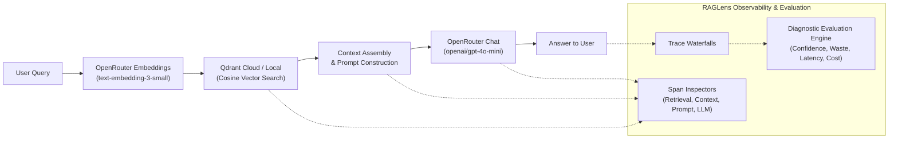

# Real RAG with Qdrant Cloud, OpenRouter & RAGLens

A production-style RAG implementation using **real vector embeddings**, a **real vector database (Qdrant Cloud)**, and **real LLM generations (OpenRouter)**, fully instrumented and evaluated by **RAGLens**.

> **No fake data, no simulated embeddings, no mock completions.**  
> Every query generates actual 1536-dimensional embeddings, retrieves nearest neighbors via cosine similarity from Qdrant, calls OpenAI via OpenRouter, and streams granular stage-by-stage traces into RAGLens.

---

## 🏗️ Architecture



---

## ⚙️ Configuration (`.env`)

Edit `examples/qdrant-openrouter-rag/.env`:

```env
# ── OpenRouter ──────────────────────────────────────────────────────────────
OPENROUTER_API_KEY=sk-or-v1-your-key-here
EMBEDDING_MODEL=text-embedding-3-small
CHAT_MODEL=openai/gpt-4o-mini

# ── Qdrant Cloud ─────────────────────────────────────────────────────────────
# Set your cluster URL and API key from https://cloud.qdrant.io
# If left empty, it automatically runs in embedded local mode!
QDRANT_URL=https://your-cluster.eu-central.aws.cloud.qdrant.io:6333
QDRANT_API_KEY=your-qdrant-api-key
QDRANT_COLLECTION_NAME=bookmyshow_rag

# ── RAGLens Observability ───────────────────────────────────────────────────
RAGLENS_API_KEY=rgl_test_bookmyshow_demo_key_123
RAGLENS_PROJECT_ID=project_aaw3236s8tx5qsr1gi0wefnyj7
RAGLENS_BASE_URL=http://localhost:8000
RAGLENS_WEB_URL=http://localhost:3000
```

---

## 🚀 Quickstart

From the repository root:

```bash
# 1. Activate the environment
source .venv/bin/activate

# 2. Launch the Web Chat Interface
python examples/qdrant-openrouter-rag/chat_server.py
# 👉 Open http://localhost:8501 in your browser

# 3. (Optional) Run CLI queries
python examples/qdrant-openrouter-rag/app.py --query "What is the cancellation policy on BookMyShow?"
python examples/qdrant-openrouter-rag/app.py --demo
```

---

## 💬 Web Chat Interface

The project includes an interactive web chat UI running on **`http://localhost:8501`**:

- **Real-Time Responses**: Type any cinema or policy question and get answers from `openai/gpt-4o-mini`.
- **Expandable Qdrant Chunks**: Click on any response to inspect the exact retrieved chunks, cosine similarity scores (e.g. `0.7293`), and selected/discarded status.
- **RAGLens Telemetry Bar**: Shows latency, token count, and dollar cost for every turn.
- **"Inspect in RAGLens ↗" Button**: Takes you directly to the full trace waterfall and diagnostics in the RAGLens dashboard.
- **Tuning Sliders**: Adjust `Top-K` and `Min Score Threshold` live in the left sidebar.

## 📊 What RAGLens Evaluates in This Real Pipeline

When you run a query, RAGLens tracks every sub-operation and evaluates its health:

1. **Retrieval Inspector**:
   - Inspects real Qdrant cosine similarity scores (e.g. `0.7142`, `0.4917`).
   - Distinguishes selected vs discarded chunks based on your confidence threshold.
   - Shows payload content, document title, and category.

2. **Context Inspector**:
   - Analyzes assembled context tokens against model window limits (4096 tokens).
   - Flags context bloat or token waste.

3. **Prompt Inspector**:
   - Visualizes system instructions, user prompts, and template parameters.

4. **LLM Inspector**:
   - Measures real generation latency (e.g. 840ms).
   - Tracks actual OpenRouter input tokens, output tokens, and dollar cost ($0.000004).

5. **Diagnostic Engine**:
   - Automatically detects out-of-domain queries when Qdrant similarity scores fall below `0.70`, issuing a `low_retrieval_confidence` warning.
   - Alerts on retrieval waste if too many chunks are fetched relative to selected.
